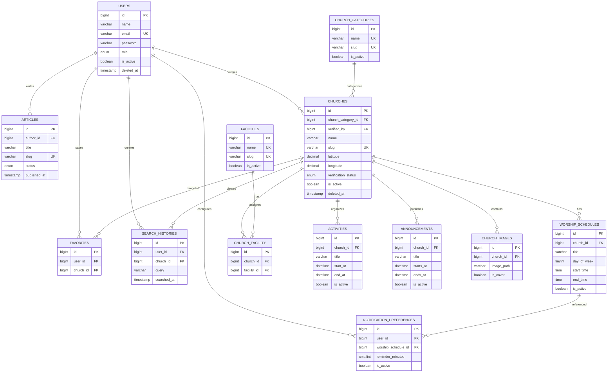

# Database Schema

## Church Finder Makassar

Dokumen ini mendefinisikan rancangan database untuk **Church Finder Makassar**, aplikasi Android berbasis Kotlin dan Jetpack Compose dengan backend Laravel 13 dan database MySQL.

Dokumen mencakup:

- daftar tabel;
- kolom dan tipe data;
- primary key dan foreign key;
- unique constraint;
- check constraint;
- index;
- relasi antarentitas;
- aturan penghapusan dan pembaruan;
- aturan validasi data;
- rekomendasi implementasi migration Laravel.

---

# 1. Database Conventions

## 1.1 Database Engine

```text
MySQL 8.x
Storage Engine: InnoDB
Character Set: utf8mb4
Collation: utf8mb4_unicode_ci
Timezone aplikasi: Asia/Makassar
```

`InnoDB` digunakan karena mendukung:

- foreign key;
- transaksi;
- row-level locking;
- crash recovery;
- index yang dibutuhkan aplikasi.

---

## 1.2 Naming Convention

| Objek | Aturan | Contoh |
|---|---|---|
| Tabel | plural dan snake_case | `worship_schedules` |
| Kolom | snake_case | `church_category_id` |
| Primary key | `id` | `id` |
| Foreign key | nama entitas tunggal + `_id` | `church_id` |
| Pivot table | nama entitas tunggal berurutan alfabetis | `church_facility` |
| Index | `idx_<table>_<columns>` | `idx_churches_category_active` |
| Unique constraint | `uq_<table>_<columns>` | `uq_users_email` |
| Foreign key constraint | `fk_<table>_<column>` | `fk_churches_category_id` |
| Check constraint | `chk_<table>_<rule>` | `chk_churches_latitude` |

---

## 1.3 Common Columns

Sebagian besar tabel menggunakan kolom berikut:

```text
id          BIGINT UNSIGNED PRIMARY KEY AUTO_INCREMENT
created_at  TIMESTAMP NULL
updated_at  TIMESTAMP NULL
```

Tabel yang membutuhkan soft delete menggunakan:

```text
deleted_at  TIMESTAMP NULL
```

---

## 1.4 ID Strategy

Semua entitas utama menggunakan `BIGINT UNSIGNED AUTO_INCREMENT` agar:

- kompatibel dengan default Laravel;
- mudah digunakan sebagai foreign key;
- cukup untuk pertumbuhan data;
- sederhana untuk kebutuhan skripsi dan produksi awal.

UUID tidak digunakan pada fase awal karena belum ada kebutuhan distribusi data lintas server atau pembuatan ID secara offline.

---

## 1.5 Coordinate Precision

Latitude dan longitude menggunakan:

```text
DECIMAL(10,7)
```

Rentang valid:

```text
Latitude  : -90.0000000 sampai 90.0000000
Longitude : -180.0000000 sampai 180.0000000
```

Tujuh angka desimal memberikan presisi yang lebih dari cukup untuk lokasi bangunan gereja.

---

# 2. Entity Relationship Overview

```text
users
├── 1 : N personal_access_tokens
├── 1 : N favorites
├── 1 : N notification_preferences
├── 1 : N search_histories
└── 1 : N articles                     sebagai author/admin

church_categories
└── 1 : N churches

churches
├── N : 1 church_categories
├── 1 : N worship_schedules
├── N : N facilities                   melalui church_facility
├── 1 : N activities
├── 1 : N announcements
├── 1 : N church_images
├── 1 : N favorites
└── 1 : N search_histories

worship_schedules
└── 1 : N notification_preferences
```

---

# 3. Core Tables

## 3.1 `users`

Menyimpan akun pengguna aplikasi dan administrator.

### Columns

| Kolom | Tipe Data | Null | Default | Keterangan |
|---|---|---:|---|---|
| `id` | BIGINT UNSIGNED | Tidak | AUTO_INCREMENT | Primary key |
| `name` | VARCHAR(100) | Tidak | — | Nama pengguna |
| `email` | VARCHAR(191) | Tidak | — | Email login |
| `email_verified_at` | TIMESTAMP | Ya | NULL | Waktu verifikasi email |
| `password` | VARCHAR(255) | Tidak | — | Hash password |
| `phone` | VARCHAR(20) | Ya | NULL | Nomor telepon |
| `role` | ENUM('user','admin') | Tidak | 'user' | Hak akses |
| `avatar_path` | VARCHAR(255) | Ya | NULL | Lokasi avatar |
| `is_active` | BOOLEAN | Tidak | TRUE | Status akun |
| `last_login_at` | TIMESTAMP | Ya | NULL | Login terakhir |
| `remember_token` | VARCHAR(100) | Ya | NULL | Token sesi web Laravel |
| `created_at` | TIMESTAMP | Ya | NULL | Waktu dibuat |
| `updated_at` | TIMESTAMP | Ya | NULL | Waktu diubah |
| `deleted_at` | TIMESTAMP | Ya | NULL | Soft delete |

### Constraints

```text
PRIMARY KEY (id)
UNIQUE (email)
CHECK (role IN ('user', 'admin'))
```

### Indexes

```text
uq_users_email (email)
idx_users_role_active (role, is_active)
idx_users_deleted_at (deleted_at)
```

### Business Rules

- Email disimpan dalam lowercase.
- Password wajib di-hash menggunakan Argon2id atau bcrypt.
- Akun yang `is_active = false` tidak dapat login.
- Soft-deleted user tidak dapat menggunakan token API.
- Nomor telepon tidak wajib karena bukan identitas login utama.

---

## 3.2 `church_categories`

Menyimpan denominasi atau kategori gereja.

### Columns

| Kolom | Tipe Data | Null | Default | Keterangan |
|---|---|---:|---|---|
| `id` | BIGINT UNSIGNED | Tidak | AUTO_INCREMENT | Primary key |
| `name` | VARCHAR(100) | Tidak | — | Nama kategori |
| `slug` | VARCHAR(120) | Tidak | — | Identifier URL |
| `description` | TEXT | Ya | NULL | Deskripsi kategori |
| `icon_path` | VARCHAR(255) | Ya | NULL | Ikon kategori |
| `sort_order` | SMALLINT UNSIGNED | Tidak | 0 | Urutan tampilan |
| `is_active` | BOOLEAN | Tidak | TRUE | Status tampilan |
| `created_at` | TIMESTAMP | Ya | NULL | Waktu dibuat |
| `updated_at` | TIMESTAMP | Ya | NULL | Waktu diubah |
| `deleted_at` | TIMESTAMP | Ya | NULL | Soft delete |

### Constraints

```text
PRIMARY KEY (id)
UNIQUE (name)
UNIQUE (slug)
CHECK (sort_order >= 0)
```

### Indexes

```text
uq_church_categories_name (name)
uq_church_categories_slug (slug)
idx_church_categories_active_order (is_active, sort_order)
```

### Initial Data

```text
Gereja Toraja
Gereja Pentakosta
Gereja Katolik
Gereja Advent
Gereja Kibaid
```

### Business Rules

- Nama dan slug harus unik.
- Kategori yang masih memiliki gereja tidak boleh dihapus permanen.
- Kategori nonaktif tidak ditampilkan pada aplikasi publik.

---

## 3.3 `churches`

Menyimpan informasi utama setiap gereja.

### Columns

| Kolom | Tipe Data | Null | Default | Keterangan |
|---|---|---:|---|---|
| `id` | BIGINT UNSIGNED | Tidak | AUTO_INCREMENT | Primary key |
| `church_category_id` | BIGINT UNSIGNED | Tidak | — | Foreign key kategori |
| `name` | VARCHAR(150) | Tidak | — | Nama gereja |
| `slug` | VARCHAR(180) | Tidak | — | Identifier URL/API |
| `address` | TEXT | Tidak | — | Alamat lengkap |
| `district` | VARCHAR(100) | Ya | NULL | Kecamatan |
| `city` | VARCHAR(100) | Tidak | 'Makassar' | Kota |
| `province` | VARCHAR(100) | Tidak | 'Sulawesi Selatan' | Provinsi |
| `postal_code` | VARCHAR(10) | Ya | NULL | Kode pos |
| `latitude` | DECIMAL(10,7) | Tidak | — | Latitude gereja |
| `longitude` | DECIMAL(10,7) | Tidak | — | Longitude gereja |
| `description` | LONGTEXT | Ya | NULL | Deskripsi gereja |
| `worship_guide` | LONGTEXT | Ya | NULL | Panduan ibadah |
| `phone` | VARCHAR(20) | Ya | NULL | Nomor telepon |
| `email` | VARCHAR(191) | Ya | NULL | Email gereja |
| `website_url` | VARCHAR(255) | Ya | NULL | Website resmi |
| `capacity` | MEDIUMINT UNSIGNED | Ya | NULL | Kapasitas jemaat |
| `main_image_path` | VARCHAR(255) | Ya | NULL | Gambar utama |
| `verification_status` | ENUM('draft','verified','rejected') | Tidak | 'draft' | Status verifikasi |
| `verified_at` | TIMESTAMP | Ya | NULL | Waktu diverifikasi |
| `verified_by` | BIGINT UNSIGNED | Ya | NULL | Admin yang memverifikasi |
| `is_active` | BOOLEAN | Tidak | TRUE | Status publikasi |
| `created_at` | TIMESTAMP | Ya | NULL | Waktu dibuat |
| `updated_at` | TIMESTAMP | Ya | NULL | Waktu diubah |
| `deleted_at` | TIMESTAMP | Ya | NULL | Soft delete |

### Constraints

```text
PRIMARY KEY (id)
UNIQUE (slug)
FOREIGN KEY (church_category_id) REFERENCES church_categories(id)
FOREIGN KEY (verified_by) REFERENCES users(id)
CHECK (latitude BETWEEN -90 AND 90)
CHECK (longitude BETWEEN -180 AND 180)
CHECK (capacity IS NULL OR capacity >= 0)
CHECK (verification_status IN ('draft', 'verified', 'rejected'))
```

### Foreign Key Actions

```text
church_category_id:
  ON UPDATE CASCADE
  ON DELETE RESTRICT

verified_by:
  ON UPDATE CASCADE
  ON DELETE SET NULL
```

### Indexes

```text
uq_churches_slug (slug)
idx_churches_category_active (church_category_id, is_active)
idx_churches_verification_active (verification_status, is_active)
idx_churches_location (latitude, longitude)
idx_churches_city_district (city, district)
idx_churches_name (name)
idx_churches_deleted_at (deleted_at)
```

### Business Rules

- Data publik hanya memenuhi kondisi:

```text
is_active = true
verification_status = 'verified'
deleted_at IS NULL
```

- `verified_at` dan `verified_by` wajib diisi ketika status menjadi `verified`.
- `verified_at` dan `verified_by` dikosongkan saat status kembali menjadi `draft`.
- Nama boleh sama apabila merupakan jemaat berbeda, tetapi slug harus unik.
- Koordinat wajib diverifikasi sebelum publikasi.
- Kota fase awal harus `Makassar`.

---

## 3.4 `worship_schedules`

Menyimpan jadwal ibadah setiap gereja.

### Columns

| Kolom | Tipe Data | Null | Default | Keterangan |
|---|---|---:|---|---|
| `id` | BIGINT UNSIGNED | Tidak | AUTO_INCREMENT | Primary key |
| `church_id` | BIGINT UNSIGNED | Tidak | — | Foreign key gereja |
| `title` | VARCHAR(120) | Tidak | — | Nama ibadah |
| `day_of_week` | TINYINT UNSIGNED | Tidak | — | Hari 1–7 |
| `start_time` | TIME | Tidak | — | Waktu mulai |
| `end_time` | TIME | Ya | NULL | Waktu selesai |
| `preacher_name` | VARCHAR(120) | Ya | NULL | Nama pengkhotbah |
| `language` | VARCHAR(50) | Ya | 'Indonesia' | Bahasa ibadah |
| `description` | TEXT | Ya | NULL | Keterangan tambahan |
| `valid_from` | DATE | Ya | NULL | Awal masa berlaku |
| `valid_until` | DATE | Ya | NULL | Akhir masa berlaku |
| `is_recurring` | BOOLEAN | Tidak | TRUE | Jadwal mingguan |
| `is_active` | BOOLEAN | Tidak | TRUE | Status jadwal |
| `created_at` | TIMESTAMP | Ya | NULL | Waktu dibuat |
| `updated_at` | TIMESTAMP | Ya | NULL | Waktu diubah |
| `deleted_at` | TIMESTAMP | Ya | NULL | Soft delete |

### Day Mapping

```text
1 = Senin
2 = Selasa
3 = Rabu
4 = Kamis
5 = Jumat
6 = Sabtu
7 = Minggu
```

### Constraints

```text
PRIMARY KEY (id)
FOREIGN KEY (church_id) REFERENCES churches(id)
CHECK (day_of_week BETWEEN 1 AND 7)
CHECK (end_time IS NULL OR end_time > start_time)
CHECK (valid_until IS NULL OR valid_from IS NULL OR valid_until >= valid_from)
```

### Foreign Key Actions

```text
ON UPDATE CASCADE
ON DELETE CASCADE
```

### Indexes

```text
idx_worship_schedules_church_active (church_id, is_active)
idx_worship_schedules_day_time (day_of_week, start_time)
idx_worship_schedules_valid_period (valid_from, valid_until)
idx_worship_schedules_deleted_at (deleted_at)
```

### Business Rules

- Jadwal aktif hanya tampil bila berada dalam periode berlaku.
- `end_time` harus lebih besar dari `start_time` jika diisi.
- Jadwal mingguan menggunakan `day_of_week` dan `is_recurring = true`.
- Nama pengkhotbah disimpan pada jadwal karena dapat berbeda setiap ibadah.

---

## 3.5 `facilities`

Menyimpan master fasilitas gereja.

### Columns

| Kolom | Tipe Data | Null | Default | Keterangan |
|---|---|---:|---|---|
| `id` | BIGINT UNSIGNED | Tidak | AUTO_INCREMENT | Primary key |
| `name` | VARCHAR(100) | Tidak | — | Nama fasilitas |
| `slug` | VARCHAR(120) | Tidak | — | Identifier |
| `icon_name` | VARCHAR(100) | Ya | NULL | Nama ikon UI |
| `description` | TEXT | Ya | NULL | Deskripsi |
| `is_active` | BOOLEAN | Tidak | TRUE | Status |
| `created_at` | TIMESTAMP | Ya | NULL | Waktu dibuat |
| `updated_at` | TIMESTAMP | Ya | NULL | Waktu diubah |
| `deleted_at` | TIMESTAMP | Ya | NULL | Soft delete |

### Constraints

```text
PRIMARY KEY (id)
UNIQUE (name)
UNIQUE (slug)
```

### Indexes

```text
uq_facilities_name (name)
uq_facilities_slug (slug)
idx_facilities_active (is_active)
```

### Example Data

```text
Area parkir
Toilet
Akses kursi roda
Ruang anak
Pendingin ruangan
Sound system
Proyektor
```

---

## 3.6 `church_facility`

Pivot table relasi many-to-many antara gereja dan fasilitas.

### Columns

| Kolom | Tipe Data | Null | Default | Keterangan |
|---|---|---:|---|---|
| `id` | BIGINT UNSIGNED | Tidak | AUTO_INCREMENT | Primary key |
| `church_id` | BIGINT UNSIGNED | Tidak | — | Foreign key gereja |
| `facility_id` | BIGINT UNSIGNED | Tidak | — | Foreign key fasilitas |
| `notes` | VARCHAR(255) | Ya | NULL | Catatan khusus |
| `created_at` | TIMESTAMP | Ya | NULL | Waktu dibuat |
| `updated_at` | TIMESTAMP | Ya | NULL | Waktu diubah |

### Constraints

```text
PRIMARY KEY (id)
UNIQUE (church_id, facility_id)
FOREIGN KEY (church_id) REFERENCES churches(id)
FOREIGN KEY (facility_id) REFERENCES facilities(id)
```

### Foreign Key Actions

```text
church_id:
  ON UPDATE CASCADE
  ON DELETE CASCADE

facility_id:
  ON UPDATE CASCADE
  ON DELETE CASCADE
```

### Indexes

```text
uq_church_facility_pair (church_id, facility_id)
idx_church_facility_facility (facility_id)
```

---

## 3.7 `activities`

Menyimpan kegiatan atau acara gereja.

### Columns

| Kolom | Tipe Data | Null | Default | Keterangan |
|---|---|---:|---|---|
| `id` | BIGINT UNSIGNED | Tidak | AUTO_INCREMENT | Primary key |
| `church_id` | BIGINT UNSIGNED | Tidak | — | Foreign key gereja |
| `title` | VARCHAR(160) | Tidak | — | Judul kegiatan |
| `slug` | VARCHAR(190) | Tidak | — | Identifier URL |
| `description` | LONGTEXT | Ya | NULL | Deskripsi |
| `location_name` | VARCHAR(160) | Ya | NULL | Lokasi kegiatan |
| `start_at` | DATETIME | Tidak | — | Mulai kegiatan |
| `end_at` | DATETIME | Ya | NULL | Selesai kegiatan |
| `image_path` | VARCHAR(255) | Ya | NULL | Poster kegiatan |
| `registration_url` | VARCHAR(255) | Ya | NULL | Link pendaftaran |
| `is_active` | BOOLEAN | Tidak | TRUE | Status publikasi |
| `created_at` | TIMESTAMP | Ya | NULL | Waktu dibuat |
| `updated_at` | TIMESTAMP | Ya | NULL | Waktu diubah |
| `deleted_at` | TIMESTAMP | Ya | NULL | Soft delete |

### Constraints

```text
PRIMARY KEY (id)
UNIQUE (slug)
FOREIGN KEY (church_id) REFERENCES churches(id)
CHECK (end_at IS NULL OR end_at >= start_at)
```

### Foreign Key Actions

```text
ON UPDATE CASCADE
ON DELETE CASCADE
```

### Indexes

```text
uq_activities_slug (slug)
idx_activities_church_active (church_id, is_active)
idx_activities_start_active (start_at, is_active)
idx_activities_deleted_at (deleted_at)
```

---

## 3.8 `announcements`

Menyimpan pengumuman umum atau khusus gereja.

### Columns

| Kolom | Tipe Data | Null | Default | Keterangan |
|---|---|---:|---|---|
| `id` | BIGINT UNSIGNED | Tidak | AUTO_INCREMENT | Primary key |
| `church_id` | BIGINT UNSIGNED | Ya | NULL | NULL berarti pengumuman umum |
| `title` | VARCHAR(160) | Tidak | — | Judul |
| `content` | LONGTEXT | Tidak | — | Isi pengumuman |
| `starts_at` | DATETIME | Tidak | — | Waktu mulai tampil |
| `ends_at` | DATETIME | Ya | NULL | Waktu berhenti tampil |
| `priority` | ENUM('low','normal','high') | Tidak | 'normal' | Prioritas |
| `is_active` | BOOLEAN | Tidak | TRUE | Status |
| `created_at` | TIMESTAMP | Ya | NULL | Waktu dibuat |
| `updated_at` | TIMESTAMP | Ya | NULL | Waktu diubah |
| `deleted_at` | TIMESTAMP | Ya | NULL | Soft delete |

### Constraints

```text
PRIMARY KEY (id)
FOREIGN KEY (church_id) REFERENCES churches(id)
CHECK (ends_at IS NULL OR ends_at >= starts_at)
CHECK (priority IN ('low', 'normal', 'high'))
```

### Foreign Key Actions

```text
ON UPDATE CASCADE
ON DELETE CASCADE
```

### Indexes

```text
idx_announcements_church_active (church_id, is_active)
idx_announcements_period (starts_at, ends_at)
idx_announcements_priority_active (priority, is_active)
idx_announcements_deleted_at (deleted_at)
```

### Business Rules

Pengumuman aktif memenuhi:

```text
is_active = true
starts_at <= NOW()
ends_at IS NULL OR ends_at >= NOW()
deleted_at IS NULL
```

---

## 3.9 `articles`

Menyimpan artikel informasi yang dikelola administrator.

### Columns

| Kolom | Tipe Data | Null | Default | Keterangan |
|---|---|---:|---|---|
| `id` | BIGINT UNSIGNED | Tidak | AUTO_INCREMENT | Primary key |
| `author_id` | BIGINT UNSIGNED | Tidak | — | Admin penulis |
| `title` | VARCHAR(180) | Tidak | — | Judul artikel |
| `slug` | VARCHAR(210) | Tidak | — | Identifier URL |
| `excerpt` | TEXT | Ya | NULL | Ringkasan |
| `content` | LONGTEXT | Tidak | — | Isi artikel |
| `thumbnail_path` | VARCHAR(255) | Ya | NULL | Thumbnail |
| `status` | ENUM('draft','published','archived') | Tidak | 'draft' | Status publikasi |
| `published_at` | TIMESTAMP | Ya | NULL | Waktu publikasi |
| `created_at` | TIMESTAMP | Ya | NULL | Waktu dibuat |
| `updated_at` | TIMESTAMP | Ya | NULL | Waktu diubah |
| `deleted_at` | TIMESTAMP | Ya | NULL | Soft delete |

### Constraints

```text
PRIMARY KEY (id)
UNIQUE (slug)
FOREIGN KEY (author_id) REFERENCES users(id)
CHECK (status IN ('draft', 'published', 'archived'))
```

### Foreign Key Actions

```text
ON UPDATE CASCADE
ON DELETE RESTRICT
```

### Indexes

```text
uq_articles_slug (slug)
idx_articles_status_published (status, published_at)
idx_articles_author (author_id)
idx_articles_deleted_at (deleted_at)
```

### Business Rules

- Artikel publik memenuhi `status = 'published'` dan `published_at <= NOW()`.
- Hanya pengguna dengan `role = 'admin'` yang dapat menjadi author.
- Artikel tidak dapat dipublikasikan tanpa judul dan isi.

---

## 3.10 `church_images`

Menyimpan galeri gambar gereja.

### Columns

| Kolom | Tipe Data | Null | Default | Keterangan |
|---|---|---:|---|---|
| `id` | BIGINT UNSIGNED | Tidak | AUTO_INCREMENT | Primary key |
| `church_id` | BIGINT UNSIGNED | Tidak | — | Foreign key gereja |
| `image_path` | VARCHAR(255) | Tidak | — | Lokasi file |
| `caption` | VARCHAR(255) | Ya | NULL | Keterangan gambar |
| `sort_order` | SMALLINT UNSIGNED | Tidak | 0 | Urutan galeri |
| `is_cover` | BOOLEAN | Tidak | FALSE | Penanda cover |
| `created_at` | TIMESTAMP | Ya | NULL | Waktu dibuat |
| `updated_at` | TIMESTAMP | Ya | NULL | Waktu diubah |

### Constraints

```text
PRIMARY KEY (id)
FOREIGN KEY (church_id) REFERENCES churches(id)
CHECK (sort_order >= 0)
```

### Foreign Key Actions

```text
ON UPDATE CASCADE
ON DELETE CASCADE
```

### Indexes

```text
idx_church_images_church_order (church_id, sort_order)
idx_church_images_cover (church_id, is_cover)
```

### Business Rules

- Maksimal satu gambar berstatus `is_cover = true` untuk setiap gereja dijaga oleh service atau transaction aplikasi.
- `main_image_path` pada tabel `churches` dapat digunakan untuk akses cepat, sementara `church_images` menyimpan galeri.

---

# 4. User Personalization Tables

## 4.1 `favorites`

Menyimpan gereja favorit pengguna.

### Columns

| Kolom | Tipe Data | Null | Default | Keterangan |
|---|---|---:|---|---|
| `id` | BIGINT UNSIGNED | Tidak | AUTO_INCREMENT | Primary key |
| `user_id` | BIGINT UNSIGNED | Tidak | — | Foreign key pengguna |
| `church_id` | BIGINT UNSIGNED | Tidak | — | Foreign key gereja |
| `created_at` | TIMESTAMP | Ya | NULL | Waktu disimpan |
| `updated_at` | TIMESTAMP | Ya | NULL | Waktu diubah |

### Constraints

```text
PRIMARY KEY (id)
UNIQUE (user_id, church_id)
FOREIGN KEY (user_id) REFERENCES users(id)
FOREIGN KEY (church_id) REFERENCES churches(id)
```

### Foreign Key Actions

```text
user_id:
  ON UPDATE CASCADE
  ON DELETE CASCADE

church_id:
  ON UPDATE CASCADE
  ON DELETE CASCADE
```

### Indexes

```text
uq_favorites_user_church (user_id, church_id)
idx_favorites_church (church_id)
```

---

## 4.2 `notification_preferences`

Menyimpan pengingat jadwal ibadah milik pengguna.

### Columns

| Kolom | Tipe Data | Null | Default | Keterangan |
|---|---|---:|---|---|
| `id` | BIGINT UNSIGNED | Tidak | AUTO_INCREMENT | Primary key |
| `user_id` | BIGINT UNSIGNED | Tidak | — | Foreign key pengguna |
| `worship_schedule_id` | BIGINT UNSIGNED | Tidak | — | Jadwal yang diingatkan |
| `reminder_minutes` | SMALLINT UNSIGNED | Tidak | 30 | Menit sebelum jadwal |
| `is_active` | BOOLEAN | Tidak | TRUE | Status pengingat |
| `last_scheduled_at` | TIMESTAMP | Ya | NULL | Terakhir sinkron ke perangkat |
| `created_at` | TIMESTAMP | Ya | NULL | Waktu dibuat |
| `updated_at` | TIMESTAMP | Ya | NULL | Waktu diubah |

### Constraints

```text
PRIMARY KEY (id)
UNIQUE (user_id, worship_schedule_id)
FOREIGN KEY (user_id) REFERENCES users(id)
FOREIGN KEY (worship_schedule_id) REFERENCES worship_schedules(id)
CHECK (reminder_minutes BETWEEN 1 AND 10080)
```

`10080` menit sama dengan tujuh hari.

### Foreign Key Actions

```text
user_id:
  ON UPDATE CASCADE
  ON DELETE CASCADE

worship_schedule_id:
  ON UPDATE CASCADE
  ON DELETE CASCADE
```

### Indexes

```text
uq_notification_preferences_user_schedule (user_id, worship_schedule_id)
idx_notification_preferences_active (user_id, is_active)
idx_notification_preferences_schedule (worship_schedule_id)
```

### Business Rules

- Untuk MVP, pengingat dieksekusi secara lokal oleh WorkManager atau AlarmManager.
- Backend menyimpan preferensi agar dapat disinkronkan kembali.
- Nilai yang direkomendasikan: `15`, `30`, `60`, atau `1440` menit.

---

## 4.3 `search_histories`

Tabel opsional untuk menyimpan riwayat gereja yang dibuka atau dicari pengguna.

### Columns

| Kolom | Tipe Data | Null | Default | Keterangan |
|---|---|---:|---|---|
| `id` | BIGINT UNSIGNED | Tidak | AUTO_INCREMENT | Primary key |
| `user_id` | BIGINT UNSIGNED | Tidak | — | Foreign key pengguna |
| `church_id` | BIGINT UNSIGNED | Ya | NULL | Gereja yang dibuka |
| `query` | VARCHAR(150) | Ya | NULL | Kata kunci pencarian |
| `searched_at` | TIMESTAMP | Tidak | CURRENT_TIMESTAMP | Waktu pencarian |

### Constraints

```text
PRIMARY KEY (id)
FOREIGN KEY (user_id) REFERENCES users(id)
FOREIGN KEY (church_id) REFERENCES churches(id)
CHECK (church_id IS NOT NULL OR query IS NOT NULL)
```

### Foreign Key Actions

```text
user_id:
  ON UPDATE CASCADE
  ON DELETE CASCADE

church_id:
  ON UPDATE CASCADE
  ON DELETE SET NULL
```

### Indexes

```text
idx_search_histories_user_time (user_id, searched_at)
idx_search_histories_church (church_id)
idx_search_histories_query (query)
```

### Scope Note

Tabel ini dapat ditunda bila riwayat pencarian hanya disimpan secara lokal melalui Room.

---

# 5. Laravel Framework Tables

## 5.1 `personal_access_tokens`

Tabel bawaan Laravel Sanctum.

### Important Columns

| Kolom | Tipe Data | Keterangan |
|---|---|---|
| `id` | BIGINT UNSIGNED | Primary key |
| `tokenable_type` | VARCHAR(255) | Tipe model pemilik token |
| `tokenable_id` | BIGINT UNSIGNED | ID pemilik token |
| `name` | TEXT | Nama token/perangkat |
| `token` | VARCHAR(64) | Hash token |
| `abilities` | TEXT | Hak akses token |
| `last_used_at` | TIMESTAMP NULL | Terakhir digunakan |
| `expires_at` | TIMESTAMP NULL | Waktu kedaluwarsa |
| `created_at` | TIMESTAMP NULL | Dibuat |
| `updated_at` | TIMESTAMP NULL | Diubah |

### Indexes

```text
UNIQUE (token)
INDEX (tokenable_type, tokenable_id)
```

### Business Rules

- Token mentah hanya dikirim sekali ketika login.
- Database menyimpan hash token.
- Token dicabut saat logout.
- Token milik akun nonaktif harus ditolak middleware.

---

## 5.2 `password_reset_tokens`

Tabel bawaan Laravel untuk reset password.

| Kolom | Tipe Data | Null | Keterangan |
|---|---|---:|---|
| `email` | VARCHAR(191) | Tidak | Primary/unique identifier |
| `token` | VARCHAR(255) | Tidak | Hash token reset |
| `created_at` | TIMESTAMP | Ya | Waktu dibuat |

---

## 5.3 `sessions`

Digunakan apabila portal administrator memakai database session.

| Kolom | Tipe Data | Keterangan |
|---|---|---|
| `id` | VARCHAR(255) | Primary key |
| `user_id` | BIGINT UNSIGNED NULL | Pengguna sesi |
| `ip_address` | VARCHAR(45) NULL | IPv4/IPv6 |
| `user_agent` | TEXT NULL | Browser |
| `payload` | LONGTEXT | Data sesi |
| `last_activity` | INT | Unix timestamp |

---

## 5.4 Queue Tables

Tabel berikut hanya diperlukan jika Laravel Queue menggunakan database driver:

```text
jobs
job_batches
failed_jobs
```

Untuk MVP, tabel dapat dibuat tetapi queue tidak wajib digunakan.

---

# 6. Complete Relationship Matrix

| Parent | Child | Relasi | Foreign Key | Delete Rule |
|---|---|---|---|---|
| `church_categories` | `churches` | 1:N | `church_category_id` | RESTRICT |
| `users` | `churches` | 1:N verifier | `verified_by` | SET NULL |
| `churches` | `worship_schedules` | 1:N | `church_id` | CASCADE |
| `churches` | `church_facility` | 1:N | `church_id` | CASCADE |
| `facilities` | `church_facility` | 1:N | `facility_id` | CASCADE |
| `churches` | `activities` | 1:N | `church_id` | CASCADE |
| `churches` | `announcements` | 1:N | `church_id` | CASCADE |
| `users` | `articles` | 1:N | `author_id` | RESTRICT |
| `churches` | `church_images` | 1:N | `church_id` | CASCADE |
| `users` | `favorites` | 1:N | `user_id` | CASCADE |
| `churches` | `favorites` | 1:N | `church_id` | CASCADE |
| `users` | `notification_preferences` | 1:N | `user_id` | CASCADE |
| `worship_schedules` | `notification_preferences` | 1:N | `worship_schedule_id` | CASCADE |
| `users` | `search_histories` | 1:N | `user_id` | CASCADE |
| `churches` | `search_histories` | 1:N | `church_id` | SET NULL |

---

# 7. Entity Relationship Diagram



---

# 8. Haversine Query Considerations

Haversine Formula menggunakan koordinat pada tabel `churches`.

Contoh query MySQL:

```sql
SELECT
    churches.*,
    (
        6371 * ACOS(
            LEAST(
                1,
                GREATEST(
                    -1,
                    COS(RADIANS(:latitude))
                    * COS(RADIANS(churches.latitude))
                    * COS(RADIANS(churches.longitude) - RADIANS(:longitude))
                    + SIN(RADIANS(:latitude))
                    * SIN(RADIANS(churches.latitude))
                )
            )
        )
    ) AS distance_km
FROM churches
WHERE churches.is_active = 1
  AND churches.verification_status = 'verified'
  AND churches.deleted_at IS NULL
ORDER BY distance_km ASC;
```

`LEAST` dan `GREATEST` digunakan untuk menjaga input `ACOS` tetap berada pada rentang `-1` sampai `1` akibat kemungkinan floating-point rounding.

---

## 8.1 Bounding Box Optimization

Apabila jumlah data bertambah, lakukan penyaringan awal menggunakan bounding box sebelum Haversine.

Perkiraan:

```text
1 derajat latitude ≈ 111,32 km
longitude bergantung pada latitude
```

Alur query:

1. hitung batas minimum dan maksimum latitude;
2. hitung batas minimum dan maksimum longitude;
3. filter kandidat menggunakan `BETWEEN`;
4. hitung Haversine hanya pada kandidat;
5. filter berdasarkan radius;
6. urutkan berdasarkan jarak.

Dengan data awal 25 gereja, optimasi ini belum wajib, tetapi index `(latitude, longitude)` tetap disediakan.

---

# 9. Validation Rules

## 9.1 User

```text
name:
  required|string|max:100

email:
  required|email|max:191|unique:users,email

password:
  required|string|min:8|confirmed

phone:
  nullable|string|max:20

role:
  required|in:user,admin
```

---

## 9.2 Church Category

```text
name:
  required|string|max:100|unique:church_categories,name

slug:
  required|string|max:120|unique:church_categories,slug

sort_order:
  integer|min:0
```

---

## 9.3 Church

```text
church_category_id:
  required|exists:church_categories,id

name:
  required|string|max:150

slug:
  required|string|max:180|unique:churches,slug

address:
  required|string

latitude:
  required|numeric|between:-90,90

longitude:
  required|numeric|between:-180,180

email:
  nullable|email|max:191

website_url:
  nullable|url|max:255

capacity:
  nullable|integer|min:0|max:16777215

verification_status:
  required|in:draft,verified,rejected

main_image:
  nullable|image|mimes:jpg,jpeg,png,webp|max:2048
```

---

## 9.4 Worship Schedule

```text
church_id:
  required|exists:churches,id

title:
  required|string|max:120

day_of_week:
  required|integer|between:1,7

start_time:
  required|date_format:H:i

end_time:
  nullable|date_format:H:i|after:start_time

valid_from:
  nullable|date

valid_until:
  nullable|date|after_or_equal:valid_from
```

---

## 9.5 Activity and Announcement

```text
start_at / starts_at:
  required|date

end_at / ends_at:
  nullable|date|after_or_equal:start_at
```

---

## 9.6 Notification Preference

```text
worship_schedule_id:
  required|exists:worship_schedules,id

reminder_minutes:
  required|integer|between:1,10080
```

---

# 10. Index Strategy

## 10.1 General Principles

Index dibuat pada:

- foreign key;
- unique identifier;
- field filter yang sering digunakan;
- field sorting;
- kombinasi kolom untuk query publik.

Index tidak dibuat secara berlebihan karena setiap index menambah biaya insert dan update.

---

## 10.2 Important Composite Indexes

| Tabel | Index | Mendukung Query |
|---|---|---|
| `churches` | `(church_category_id, is_active)` | Filter kategori aktif |
| `churches` | `(verification_status, is_active)` | Daftar gereja publik |
| `churches` | `(latitude, longitude)` | Kandidat lokasi |
| `worship_schedules` | `(church_id, is_active)` | Jadwal gereja aktif |
| `activities` | `(church_id, is_active)` | Kegiatan gereja |
| `activities` | `(start_at, is_active)` | Kegiatan mendatang |
| `announcements` | `(starts_at, ends_at)` | Periode aktif |
| `articles` | `(status, published_at)` | Artikel publik terbaru |
| `favorites` | `(user_id, church_id)` | Cek favorit dan duplikasi |
| `notification_preferences` | `(user_id, is_active)` | Pengingat aktif pengguna |

---

# 11. Delete and Update Policy

## 11.1 Restrict

Gunakan `RESTRICT` bila child data menunjukkan entitas parent masih digunakan.

Contoh:

- kategori gereja tidak boleh dihapus bila masih memiliki gereja;
- author artikel tidak boleh dihapus permanen bila artikel masih tersimpan.

---

## 11.2 Cascade

Gunakan `CASCADE` bila child tidak memiliki arti tanpa parent.

Contoh:

- jadwal ibadah ketika gereja dihapus;
- galeri gereja;
- pivot fasilitas;
- favorit ketika user atau gereja dihapus;
- preferensi notifikasi ketika jadwal dihapus.

---

## 11.3 Set Null

Gunakan `SET NULL` bila relasi historis dapat dipertahankan tanpa parent.

Contoh:

- `verified_by` menjadi NULL ketika akun admin dihapus;
- `church_id` pada riwayat pencarian menjadi NULL ketika gereja dihapus.

---

## 11.4 Soft Delete

Soft delete digunakan untuk:

```text
users
church_categories
churches
worship_schedules
facilities
activities
announcements
articles
```

Pivot dan tabel personal tidak wajib memakai soft delete karena dapat dibuat ulang.

---

# 12. Transaction Boundaries

Transaksi database wajib digunakan pada operasi berikut:

## 12.1 Create Church

```text
BEGIN
  insert churches
  insert church_facility
  insert church_images
  insert worship_schedules opsional
COMMIT
```

Jika salah satu proses gagal:

```text
ROLLBACK
```

---

## 12.2 Update Church with Image

```text
BEGIN
  update churches
  update facilities pivot
  insert/delete image records
COMMIT
```

File fisik baru sebaiknya diunggah terlebih dahulu dan dihapus kembali jika transaksi database gagal.

---

## 12.3 Verification

```text
BEGIN
  validate required church data
  set verification_status = verified
  set verified_by = authenticated admin
  set verified_at = current timestamp
COMMIT
```

---

# 13. Data Integrity Rules

1. Gereja publik harus memiliki kategori aktif.
2. Gereja publik wajib memiliki koordinat valid.
3. Gereja berstatus `verified` wajib memiliki alamat, kategori, latitude, dan longitude.
4. Favorit hanya dapat dibuat oleh pengguna aktif.
5. Jadwal tidak dapat dibuat untuk gereja yang tidak tersedia.
6. Pengingat tidak dapat dibuat untuk jadwal nonaktif atau sudah dihapus.
7. Admin tidak boleh menonaktifkan kategori tanpa menangani gereja aktif di dalamnya.
8. Artikel terbit wajib memiliki `published_at`.
9. Pengumuman tidak boleh memiliki `ends_at` sebelum `starts_at`.
10. Satu gereja tidak boleh memiliki pasangan fasilitas yang sama lebih dari satu kali.
11. Email pengguna bersifat case-insensitive pada level aplikasi.
12. Slug dibuat dari nama dan diselesaikan konflik uniknya oleh aplikasi.

---

# 14. Recommended Laravel Model Relations

## `User.php`

```php
public function favorites()
{
    return $this->hasMany(Favorite::class);
}

public function favoriteChurches()
{
    return $this->belongsToMany(Church::class, 'favorites')
        ->withTimestamps();
}

public function notificationPreferences()
{
    return $this->hasMany(NotificationPreference::class);
}

public function articles()
{
    return $this->hasMany(Article::class, 'author_id');
}
```

---

## `ChurchCategory.php`

```php
public function churches()
{
    return $this->hasMany(Church::class);
}
```

---

## `Church.php`

```php
public function category()
{
    return $this->belongsTo(ChurchCategory::class, 'church_category_id');
}

public function verifier()
{
    return $this->belongsTo(User::class, 'verified_by');
}

public function worshipSchedules()
{
    return $this->hasMany(WorshipSchedule::class);
}

public function facilities()
{
    return $this->belongsToMany(Facility::class, 'church_facility')
        ->withPivot('notes')
        ->withTimestamps();
}

public function activities()
{
    return $this->hasMany(Activity::class);
}

public function announcements()
{
    return $this->hasMany(Announcement::class);
}

public function images()
{
    return $this->hasMany(ChurchImage::class);
}

public function favorites()
{
    return $this->hasMany(Favorite::class);
}
```

---

## `WorshipSchedule.php`

```php
public function church()
{
    return $this->belongsTo(Church::class);
}

public function notificationPreferences()
{
    return $this->hasMany(NotificationPreference::class);
}
```

---

# 15. Example Laravel Migration

## 15.1 `churches` Migration

```php
Schema::create('churches', function (Blueprint $table) {
    $table->id();
    $table->foreignId('church_category_id')
        ->constrained('church_categories')
        ->cascadeOnUpdate()
        ->restrictOnDelete();

    $table->string('name', 150);
    $table->string('slug', 180)->unique();
    $table->text('address');
    $table->string('district', 100)->nullable();
    $table->string('city', 100)->default('Makassar');
    $table->string('province', 100)->default('Sulawesi Selatan');
    $table->string('postal_code', 10)->nullable();
    $table->decimal('latitude', 10, 7);
    $table->decimal('longitude', 10, 7);
    $table->longText('description')->nullable();
    $table->longText('worship_guide')->nullable();
    $table->string('phone', 20)->nullable();
    $table->string('email', 191)->nullable();
    $table->string('website_url')->nullable();
    $table->unsignedMediumInteger('capacity')->nullable();
    $table->string('main_image_path')->nullable();
    $table->enum('verification_status', ['draft', 'verified', 'rejected'])
        ->default('draft');
    $table->timestamp('verified_at')->nullable();
    $table->foreignId('verified_by')
        ->nullable()
        ->constrained('users')
        ->cascadeOnUpdate()
        ->nullOnDelete();
    $table->boolean('is_active')->default(true);
    $table->timestamps();
    $table->softDeletes();

    $table->index(
        ['church_category_id', 'is_active'],
        'idx_churches_category_active'
    );
    $table->index(
        ['verification_status', 'is_active'],
        'idx_churches_verification_active'
    );
    $table->index(
        ['latitude', 'longitude'],
        'idx_churches_location'
    );
});
```

Check constraint dapat ditambahkan melalui raw statement apabila diperlukan:

```php
DB::statement(
    'ALTER TABLE churches
     ADD CONSTRAINT chk_churches_latitude
     CHECK (latitude BETWEEN -90 AND 90)'
);

DB::statement(
    'ALTER TABLE churches
     ADD CONSTRAINT chk_churches_longitude
     CHECK (longitude BETWEEN -180 AND 180)'
);
```

---

## 15.2 `favorites` Migration

```php
Schema::create('favorites', function (Blueprint $table) {
    $table->id();
    $table->foreignId('user_id')
        ->constrained()
        ->cascadeOnUpdate()
        ->cascadeOnDelete();
    $table->foreignId('church_id')
        ->constrained()
        ->cascadeOnUpdate()
        ->cascadeOnDelete();
    $table->timestamps();

    $table->unique(
        ['user_id', 'church_id'],
        'uq_favorites_user_church'
    );
});
```

---

# 16. Seeder Order

Seeder harus dijalankan berdasarkan dependency:

```text
1. UserSeeder
2. ChurchCategorySeeder
3. FacilitySeeder
4. ChurchSeeder
5. ChurchFacilitySeeder
6. WorshipScheduleSeeder
7. ChurchImageSeeder
8. ActivitySeeder
9. AnnouncementSeeder
10. ArticleSeeder
```

Contoh `DatabaseSeeder`:

```php
$this->call([
    UserSeeder::class,
    ChurchCategorySeeder::class,
    FacilitySeeder::class,
    ChurchSeeder::class,
    ChurchFacilitySeeder::class,
    WorshipScheduleSeeder::class,
]);
```

---

# 17. Minimum Initial Dataset

Target data awal penelitian:

| Entitas | Minimum |
|---|---:|
| Administrator | 1 |
| Pengguna contoh | 1–5 |
| Kategori gereja | 5 |
| Gereja per kategori | 5 |
| Total gereja | 25 |
| Jadwal per gereja | Minimal 1 |
| Master fasilitas | Minimal 5 |
| Artikel | Minimal 3 |
| Pengumuman | Minimal 3 |

Data awal gereja wajib memiliki:

```text
name
church_category_id
address
latitude
longitude
verification_status = verified
is_active = true
```

---

# 18. Room Local Schema

Room digunakan sebagai cache aplikasi Android, bukan sumber data utama.

## 18.1 `cached_categories`

| Kolom | Tipe Kotlin/SQLite | Keterangan |
|---|---|---|
| `id` | INTEGER PRIMARY KEY | ID dari server |
| `name` | TEXT | Nama kategori |
| `slug` | TEXT | Slug |
| `icon_url` | TEXT NULL | URL ikon |
| `sort_order` | INTEGER | Urutan |
| `cached_at` | INTEGER | Epoch millis |

---

## 18.2 `cached_churches`

| Kolom | Tipe Kotlin/SQLite | Keterangan |
|---|---|---|
| `id` | INTEGER PRIMARY KEY | ID server |
| `category_id` | INTEGER | Kategori |
| `name` | TEXT | Nama |
| `slug` | TEXT | Slug |
| `address` | TEXT | Alamat |
| `latitude` | REAL | Latitude |
| `longitude` | REAL | Longitude |
| `distance_km` | REAL NULL | Jarak terakhir |
| `image_url` | TEXT NULL | Gambar |
| `is_favorite` | INTEGER | Boolean SQLite |
| `cached_at` | INTEGER | Epoch millis |

### Room Indexes

```text
INDEX(category_id)
INDEX(name)
INDEX(cached_at)
```

Jarak pada cache bersifat sementara karena berubah mengikuti lokasi pengguna.

---

# 19. Schema Decisions

## 19.1 Mengapa `users` dan `admins` Tidak Dipisah

Satu tabel dipilih karena:

- field autentikasi sama;
- Laravel authentication lebih sederhana;
- role cukup membedakan akses;
- menghindari duplikasi tabel dan logika login.

---

## 19.2 Mengapa Jadwal Dipisah dari Gereja

Satu gereja dapat memiliki banyak ibadah dengan:

- hari berbeda;
- waktu berbeda;
- pengkhotbah berbeda;
- masa berlaku berbeda.

Karena itu, jadwal tidak boleh disimpan sebagai satu field pada tabel `churches`.

---

## 19.3 Mengapa Fasilitas Menggunakan Pivot

Satu gereja memiliki banyak fasilitas dan satu jenis fasilitas dimiliki banyak gereja. Relasi many-to-many menghindari pengulangan nama fasilitas.

---

## 19.4 Mengapa Artikel dan Pengumuman Dipisah

Artikel merupakan konten panjang dan permanen, sedangkan pengumuman:

- memiliki periode aktif;
- dapat bersifat singkat;
- dapat terkait satu gereja atau seluruh aplikasi;
- membutuhkan prioritas.

---

## 19.5 Mengapa Menggunakan Soft Delete

Soft delete dipilih untuk data administrasi karena:

- kesalahan penghapusan dapat dipulihkan;
- riwayat penelitian tetap tersedia;
- relasi historis tidak langsung hilang;
- administrator dapat menonaktifkan data tanpa penghapusan permanen.

---

## 19.6 Mengapa Tidak Menyimpan Jarak

Jarak tidak disimpan pada tabel `churches` karena bergantung pada lokasi pengguna. Jarak dihitung saat request menggunakan koordinat pengguna.

---

## 19.7 Mengapa Tidak Menyimpan Rute

Rute jalan tidak disimpan karena:

- rute dapat berubah;
- kondisi lalu lintas dinamis;
- navigasi ditangani Google Maps;
- Haversine hanya menghasilkan jarak geografis.

---

# 20. Schema Acceptance Criteria

Skema database dinyatakan siap apabila:

1. seluruh migration dapat dijalankan tanpa error;
2. seluruh foreign key berhasil dibuat;
3. seeder menghasilkan minimal 25 gereja;
4. duplikasi email pengguna ditolak;
5. duplikasi slug ditolak;
6. duplikasi favorit ditolak;
7. koordinat di luar rentang valid ditolak;
8. jadwal dengan waktu selesai sebelum mulai ditolak;
9. gereja publik dapat difilter berdasarkan kategori;
10. query Haversine menghasilkan jarak dan sorting yang benar;
11. penghapusan gereja menangani seluruh child sesuai foreign key policy;
12. soft-deleted data tidak muncul pada API publik;
13. relasi Eloquent dapat dimuat tanpa N+1 query pada endpoint detail;
14. tabel lokal Room dapat menyimpan dan memperbarui cache dari API.

---

# 21. Final Table List

## Required for MVP

```text
users
personal_access_tokens
password_reset_tokens
sessions
church_categories
churches
worship_schedules
facilities
church_facility
activities
announcements
articles
church_images
favorites
notification_preferences
```

## Optional

```text
search_histories
jobs
job_batches
failed_jobs
```

---

# 22. Conclusion

Skema Church Finder Makassar dirancang sebagai database relasional yang terstruktur, terukur, dan sesuai dengan Laravel 13. Database memisahkan data gereja, kategori, jadwal, fasilitas, kegiatan, konten, dan personalisasi pengguna agar setiap entitas memiliki tanggung jawab yang jelas.

Integritas data dijaga melalui foreign key, unique constraint, check constraint, index, transaksi, validasi Laravel, dan soft delete. Koordinat gereja disimpan dengan presisi tujuh angka desimal dan digunakan untuk perhitungan Haversine secara dinamis tanpa menyimpan nilai jarak permanen.

Struktur ini cukup sederhana untuk kebutuhan skripsi dengan 25 data gereja, tetapi tetap dapat dikembangkan ketika cakupan wilayah, jumlah gereja, atau fitur aplikasi bertambah.
